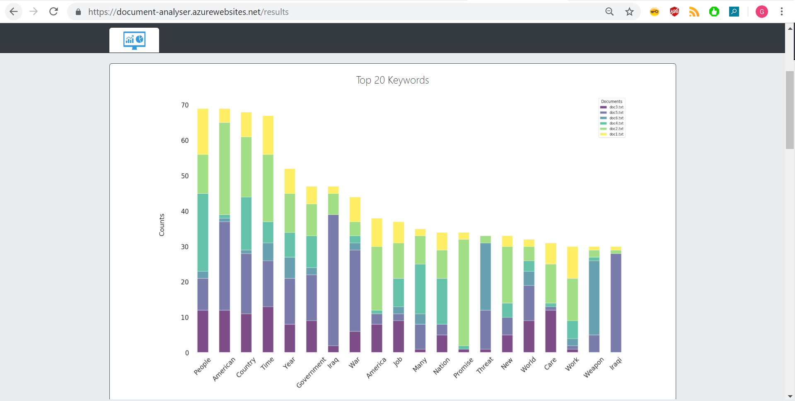

# Document Analyser Application
URL: https://document-analyser.azurewebsites.net/<br/>

### Scope
The purpose of this web app is to generate insights from documents contents (text files and pdf scans).
The user can select multiple documents to generate the following :
- Bar plot chart with the top 20 keywords in all documents
- Word cloud visualisation showing the most important keywords in all documents
- Toics identification table
- Key phrases containing the most important keywords

### Dependencies
This is a Python Flask project integrating the following modules: 
- Computer Vision (Google's Tesseract OCR)
- Pdf to Image module (Pdf2image)
- NLTK for Natural Language processing
- Pandas, Seaborn, and Matplotlib for data processing and visualisation

### App Overview

Home page
<br>


Loading page (Extract data and generate results)
<br>


Bar plot showing the top N keywords per uploaded document
<br>


Wordcloud visualisation
<br>


Topic identification and key sentences tables
<br>

<br>


### To run the app locally with Docker
In the command prompt, run the following :
1.	Install Docker
    ```
    $ pip install docker
    ```
2.  Verify Docker installation
    ```
    $ docker version
    ```
3.  cd into the app folder
    ```
    $ cd full/path/to/document-analyser-app/app
    ```
4.	Build docker image
    ```
    $ docker build -t doc_analyser_image:latest .
    ```
5.	Generate and run a container
    ```
    $ docker run -p 5000:5000 doc_analyser_image:latest
    ```
6.	Visit http://localhost:5000/
<br>

### To run the app locally with Python
In the command prompt,
1.	cd into the app folder
    ```
    $ cd full/path/to/document-analyser-app/app
    ```
2.  Activate the virtual environment
    ```
    $ .\env\Scripts\activate
    ```
4.  Un-comment the following line 35 in app.py and save the file
    ```
    # pytesseract.pytesseract.tesseract_cmd = TESSERACT_FOLDER + r"/tesseract.exe"
    ```
5.  Run the app from the command line
    ```
    $ python .\app.py
    ```
4.	Visit http://localhost:5000/
